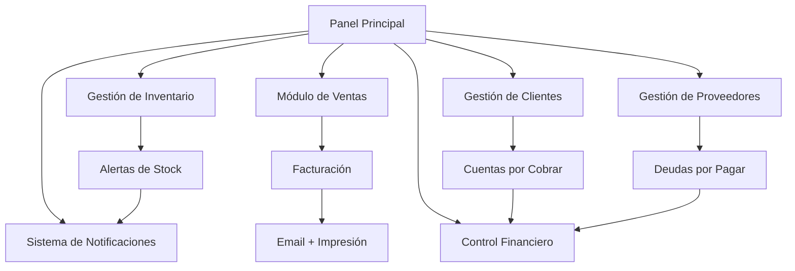

# Sistema POS para Bodega de Vinos

## 1. Descripción General del Producto

Sistema integral de punto de venta (POS) diseñado específicamente para bodegas de vinos que permite gestionar inventario, ventas, clientes, proveedores y finanzas de manera eficiente.

El sistema resuelve la necesidad de automatizar y centralizar todas las operaciones comerciales de una bodega, desde la gestión de insumos para producción hasta el control financiero completo, proporcionando herramientas para optimizar la rentabilidad y mejorar la experiencia del cliente.

Objetivo: Crear una solución tecnológica que permita a las bodegas de vino digitalizar completamente sus operaciones comerciales y administrativas.

## 2. Características Principales

### 2.1 Roles de Usuario

| Rol           | Método de Registro           | Permisos Principales                                                                     |
| ------------- | ---------------------------- | ---------------------------------------------------------------------------------------- |
| Administrador | Registro directo del sistema | Acceso completo a todos los módulos, gestión de usuarios, configuración del sistema      |
| Trabajador    | Creado por administrador     | Registro de ventas/pedidos, marcado de horarios, acceso limitado a reportes              |
| Distribuidor  | Invitación del administrador | Registro de ventas de distribución, generación de facturas, acceso a su panel específico |

### 2.2 Módulos del Sistema

Nuestro sistema POS está compuesto por los siguientes módulos principales:

1. **Panel Principal**: dashboard con métricas clave, accesos rápidos y notificaciones importantes.
2. **Gestión de Inventario**: control de insumos, productos terminados, alertas de stock bajo.
3. **Módulo de Ventas**: registro de ventas, generación de facturas, seguimiento de ingresos mensuales.
4. **Gestión de Clientes**: registro y administración de datos de clientes.
5. **Gestión de Proveedores**: administración de proveedores y registro de compras.
6. **Control Financiero**: seguimiento de ingresos, egresos, costos fijos y variables.
7. **Sistema de Notificaciones**: alertas automáticas para stock, pedidos y fechas límite.

### 2.3 Detalles de Páginas

| Nombre de Página          | Nombre del Módulo       | Descripción de Características                                                                    |
| ------------------------- | ----------------------- | ------------------------------------------------------------------------------------------------- |
| Panel Principal           | Dashboard Principal     | Mostrar métricas de ventas del día/mes, alertas críticas, accesos rápidos a funciones principales |
| Panel Principal           | Navegación Rápida       | Proporcionar acceso directo a todas las secciones del sistema                                     |
| Gestión de Inventario     | Control de Stock        | Registrar insumos (botellas, corchos, etiquetas), productos terminados, niveles de stock actual   |
| Gestión de Inventario     | Alertas de Inventario   | Generar alertas automáticas cuando el stock esté bajo, calcular disponibilidad para pedidos       |
| Módulo de Ventas          | Registro de Ventas      | Crear nuevas ventas, seleccionar productos, calcular totales, aplicar descuentos                  |
| Módulo de Ventas          | Facturación             | Generar facturas automáticas, envío por email, impresión en impresora térmica                     |
| Módulo de Ventas          | Reportes de Ingresos    | Visualizar ingresos diarios, mensuales, anuales con gráficos                                      |
| Gestión de Clientes       | Registro de Clientes    | Almacenar datos completos: nombre, teléfono, dirección, historial de compras                      |
| Gestión de Clientes       | Cuentas por Cobrar      | Mostrar deudas pendientes de clientes, fechas de vencimiento, gestión de pagos                    |
| Gestión de Proveedores    | Registro de Proveedores | Administrar datos de proveedores, historial de compras                                            |
| Gestión de Proveedores    | Panel Distribuidor      | Permitir a distribuidores registrar sus ventas y generar facturas                                 |
| Control Financiero        | Ingresos y Egresos      | Registrar todos los movimientos financieros, categorizar gastos fijos y variables                 |
| Control Financiero        | Deudas por Pagar        | Gestionar deudas con proveedores, bancos, fechas de vencimiento                                   |
| Sistema de Notificaciones | Centro de Alertas       | Mostrar todas las notificaciones: stock bajo, pedidos próximos a vencer, recordatorios de pago    |

## 3. Proceso Principal

**Flujo de Operación Principal:**
El administrador configura el inventario inicial y registra productos. Los trabajadores registran ventas diarias seleccionando productos del inventario, el sistema calcula automáticamente la disponibilidad y genera facturas. Las facturas se envían por email al cliente y se pueden imprimir en impresora térmica. El sistema actualiza automáticamente el inventario y registra los ingresos. Cuando el stock baja, se generan alertas automáticas.

**Flujo del Distribuidor:**
El distribuidor accede a su panel específico, registra las ventas de productos distribuidos, genera facturas para sus clientes y el sistema registra estos movimientos en el control financiero general.

**Flujo de Control de Trabajadores:**
Los trabajadores marcan su hora de entrada y salida, registran ventas y pedidos según sus permisos, y el sistema calcula automáticamente las horas trabajadas para el pago.

## 4. Diseño de Interfaz de Usuario

### 4.1 Estilo de Diseño

* **Colores Primarios**: #8B5A3C (marrón vino), #F4F1E8 (beige claro)

* **Colores Secundarios**: #2D5A27 (verde oscuro), #DC2626 (rojo para alertas)

* **Estilo de Botones**: Redondeados con sombras suaves, efecto hover

* **Tipografía**: Inter como fuente principal, tamaños 14px-16px para texto, 24px-32px para títulos

* **Estilo de Layout**: Diseño basado en tarjetas, navegación lateral fija, diseño limpio y profesional

* **Iconos**: Iconos de Lucide React, estilo minimalista y consistente

### 4.2 Resumen de Diseño de Páginas

| Nombre de Página | Nombre del Módulo   | Elementos de UI                                                            |
| ---------------- | ------------------- | -------------------------------------------------------------------------- |
| Panel Principal  | Dashboard Principal | Tarjetas de métricas con colores #8B5A3C, gráficos interactivos, layout de |

